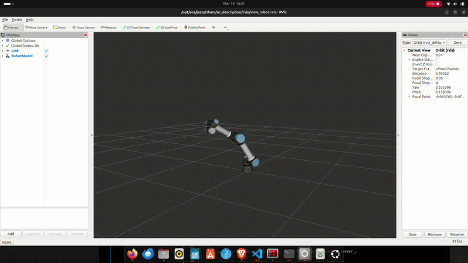
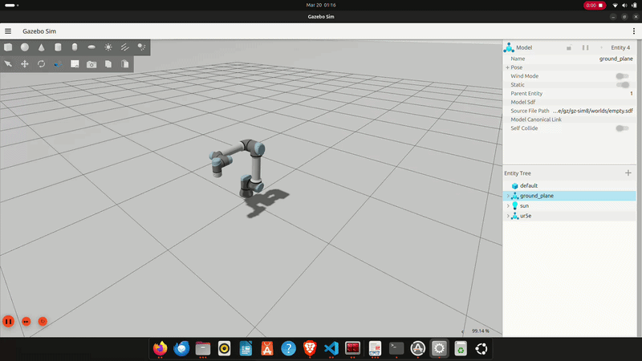

# 🎮 UR5e Xbox Controller Teleoperation (ROS 2 Jazzy)

This project allows you to **control a UR5e robot** in both **RViz** (visualization) and **Gazebo** (physics simulation) using an **Xbox controller** under **ROS 2 Jazzy**.  
It replaces the `joint_state_publisher_gui` sliders with a C++ node that that converts real-time joystick input into joint trajectory commands for a simulated robot.

---

## 📺 RViz Demo

#
---

## 📺 Gazebo Demo

#
---

## 🧩 Overview

The ur5e_xbox_joint_publisher package now supports two modes of operation:

**1. RViz Mode (Kinematic Visualization)**

- Node: ur5e_xbox_joint_publisher
- Function: Directly publishes sensor_msgs/msg/JointState to /joint_states.
- Use Case: Light-weight testing of joint mappings and URDF visualization.

**2. Gazebo Mode (Dynamic Simulation)**

- Node: ur5e_xbox_gazebo
- Function: Publishes trajectory_msgs/msg/JointTrajectory to the ur5e_arm_controller.
- Features: Uses a custom Xacro wrapper (gazebo_ur5e.xacro) to inject ros2_control hardware interfaces.
    1. Uses Gazebo Sim with the gz_ros2_control plugin.
    2. Full physics interaction and gravity compensation.

**The Robot model**

UR5e robot model from [`Universal_Robots_ROS2_Description`](https://github.com/UniversalRobots/Universal_Robots_ROS2_Description) is used here.

---

## ⚙️ Requirements

- **ROS 2 Jazzy**
- **Gazebo Sim (Included with ROS 2 desktop-full)**
- **Xbox controller**

---

## Build and Launch

Install ROS 2 Jazzy from [`ROS 2 Documentation: jazzy`](https://docs.ros.org/en/jazzy/Installation.html)

After installation of ROS 2 Jazzy, In the terminal

`source /opt/ros/jazzy/setup.bash`

`git clone https://github.com/yoursrealkiran/ur5e_controllers.git`

`cd ur5e_controllers`

`colcon build --packages-select ur5e_xbox_joint_publisher`

`source install/setup.bash`

**Launching in RViz (Visualization Only)**

`ros2 launch ur5e_xbox_joint_publisher ur5e_xbox_rviz.launch.py`

**Launching in Gazebo (Physics Simulation)**

`ros2 launch ur5e_xbox_joint_publisher ur5e_xbox_gazebo.launch.py`

Note: Before launching, make sure the Xbox controller is connected to your PC/system.

