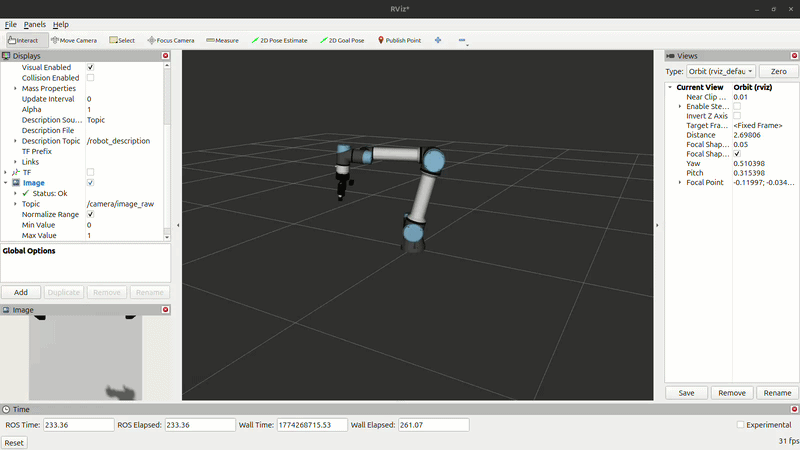
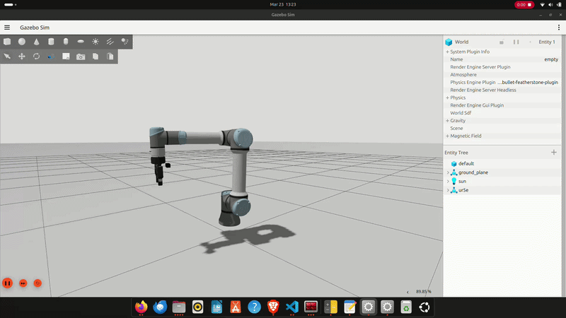
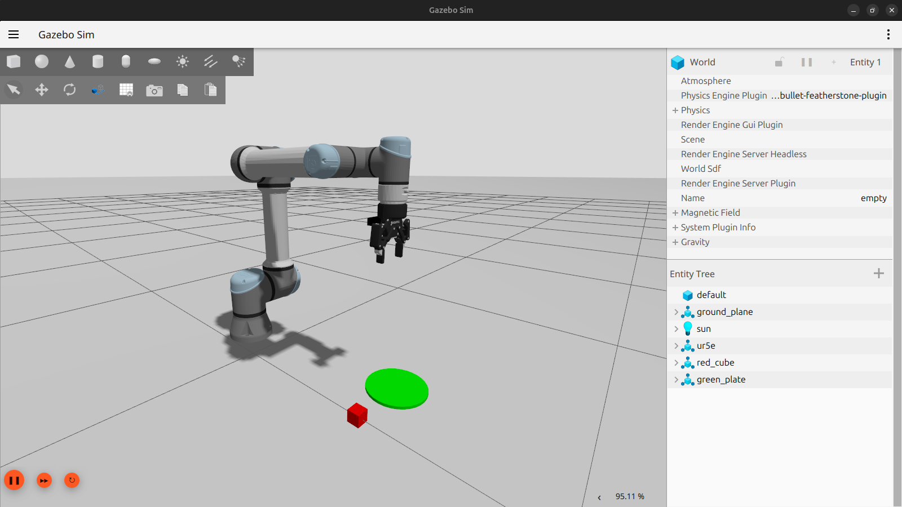
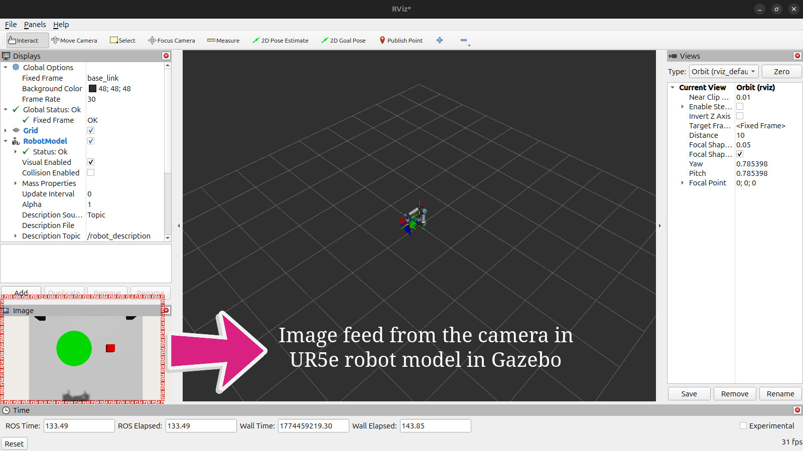

# 🎮 UR5e Xbox Controller Teleoperation (ROS 2 Jazzy) in Gazebo simulation to collect synthetic dataset

This project allows you to **control a UR5e robot (with Robotiq gripper)** in both **RViz** (visualization) and **Gazebo** (physics simulation) using an **Xbox controller** under **ROS 2 Jazzy**. The UR5e is now equipped with a tool-mounted camera for First-Person View (FPV) teleoperation. 

This project also includes a package called **ur5e_data_collector** created for synthetic data collection from the simulation (dataset has image data from camera and proprioception data from robot).

---

## 📺 RViz Demo

#
---

## 📺 Gazebo Demo

#
---

## 📺 With objects for Pick and Place task (Gazebo)

#
---

## 📺 Camera feed of Pick and Place task objects from the camera in robot model (RViz)

#
---

## 🧩 Overview

The **ur5e_xbox_joint_publisher** package supports two modes of operation:

**1. RViz Mode (Kinematic Visualization)**

- Node: ur5e_xbox_joint_publisher
- Function: Directly publishes sensor_msgs/msg/JointState to /joint_states.
- Use Case: Light-weight testing of joint mappings and URDF visualization.

**2. Gazebo (Dynamic Simulation) + RViz Mode**

- Node: ur5e_xbox_gazebo
- Function: Publishes trajectory_msgs/msg/JointTrajectory to the ur5e_arm_controller and the gripper_controller.
- Features: Uses a custom Xacro wrapper (gazebo_ur5e.xacro) to inject ros2_control hardware interfaces.
    1. Uses Gazebo Sim with the gz_ros2_control plugin.
    2. Full physics interaction and gravity compensation.
    3. End-Effector: Integrated Robotiq 2F-85 Gripper with parallel linkage mimicry.
    4. Camera: Mounted on the robotiq_85_base_link (Resolution: 640x480 @ 30fps), ROS 2 Topic: /camera/image_raw (Bridged from Gazebo Sim).
    5. To use camera, add Image Display panel in RViz and Set the topic to /camera/image_raw.

The **ur5e_data_collector** package can be used to collect synthetic dataset from the Gazebo simulation.

- Image data from camera 
- Proprioception data from robot model 

---

## ⚙️ Requirements

- **ROS 2 Jazzy**
- **Gazebo Sim**
- **Xbox controller**
- **Universal_Robots_ROS2_Description**
- **Robotiq description package**

---

## Build and Launch

**Install ROS 2 Jazzy**

Install ROS 2 Jazzy from [`ROS 2 Documentation: jazzy`](https://docs.ros.org/en/jazzy/Installation.html)

After installation of ROS 2 Jazzy, In the terminal

`source /opt/ros/jazzy/setup.bash`

**Install Robotiq description package**

The Gripper: Install Robotiq description package using below command in the terminal,

`sudo apt install ros-jazzy-robotiq-description`

**Clone this repository**

In the terminal, use below command

`git clone https://github.com/yoursrealkiran/ur5e_controllers.git`

**The Robot model**

UR5e robot model from [`Universal_Robots_ROS2_Description`](https://github.com/UniversalRobots/Universal_Robots_ROS2_Description) is used here.

Navigate to src/ folder 

`cd ur5e_controllers/src`

Clone Universal_Robots_ROS2_Description repository

`git clone https://github.com/UniversalRobots/Universal_Robots_ROS2_Description.git`

**Build all the packages**

Use below command to navigate back to ur5e_controllers folder (i.e, come out of src/ folder) 

`cd ..`

`colcon build --packages-select ur5e_xbox_joint_publisher ur_description ur5e_data_collector`

`source install/setup.bash`

**Launching in RViz (Visualization Only)**

`ros2 launch ur5e_xbox_joint_publisher ur5e_xbox_rviz.launch.py`

**Launching in Gazebo (Physics Simulation) and RViz**

`ros2 launch ur5e_xbox_joint_publisher ur5e_xbox_gazebo.launch.py`

Note: Before launching, make sure the Xbox controller is connected to your PC/system.

**To collect synthetic dataset from the above simulation, run the below command**

ros2 run ur5e_data_collector logger --ros-args -p use_sim_time:=true`

press `back` button in Xbox controller to START/STOP recording dataset for each episode

